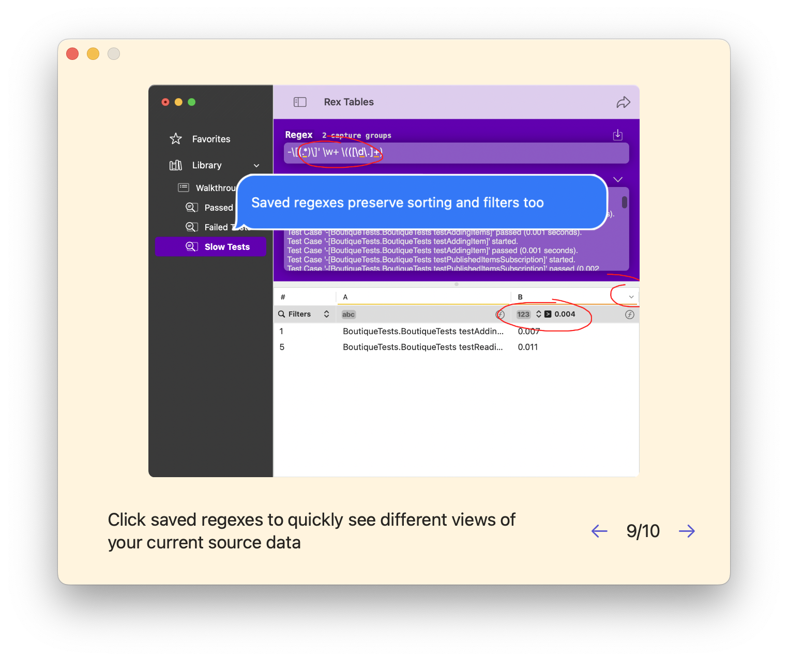

# MarkWalkthrough

A SwiftUI package to quickly build app walkthroughs.

This is some code I extracted from my app Rex Tables — the demo app in this repo is the original Rex Tables walkthrough.

MarkWalkthrough uses a list of images, text and transitions and displays a walkthrough window letting the user navigate through the "slides".

You define the walkthrough slides in Markdown like so:

```markdown
| image          | sticker  | stickerOffset | stickerScale | transition    | text                                                                                                                                                     |
| -------------- | -------- | ------------- | ------------ | ------------- | -------------------------------------------------------------------------------------------------------------------------------------------------------- |
| Icon_256x256   |          |               |              | swoosh,vanish | Welcome to Rex Tables!  Rex allows you to work with ad-hoc spreadsheets generated on-the-fly from your text files.  Click the arrows to advance          |
| app-window-1   |          |               |              | skid,         | This is the Rex Tables window — write a regex at the top, the app finds matches in the source text and displays an interactive spreadsheet at the bottom |
...
```

A simple demo app could look like this:

```swift
struct DemoAppApp: App {
    let viewModel = try! MarkWalkthroughModel(
        from: Bundle.main.url(forResource: "Walkthrough", withExtension: "md")!
    )

    var body: some Scene {
        WindowGroup {
            MarkWalkthroughWindow(viewModel: viewModel, closeAction: {})
                .background(Color("BackgroundColor"))
                .frame(width: 650, height: 500, alignment: .top)
        }
        .windowResizability(.contentSize)
        .windowStyle(.hiddenTitleBar)
    }
}
```


MarkWalkthrough builds a view with the given slide image and text and optionally adds a sticker, if defined:



## Installation

Use the package directly in Xcode or via SwiftPM.

```swift
dependencies: [
  .package(url: "https://github.com/icanzilb/MarkWalkthrough", from: "0.6.0"),
]
```

## Credits

MIT License, Marin Todorov (2023)

https://www.underplot.com

[@icanzilb](https://mastodon.social/@icanzilb)

